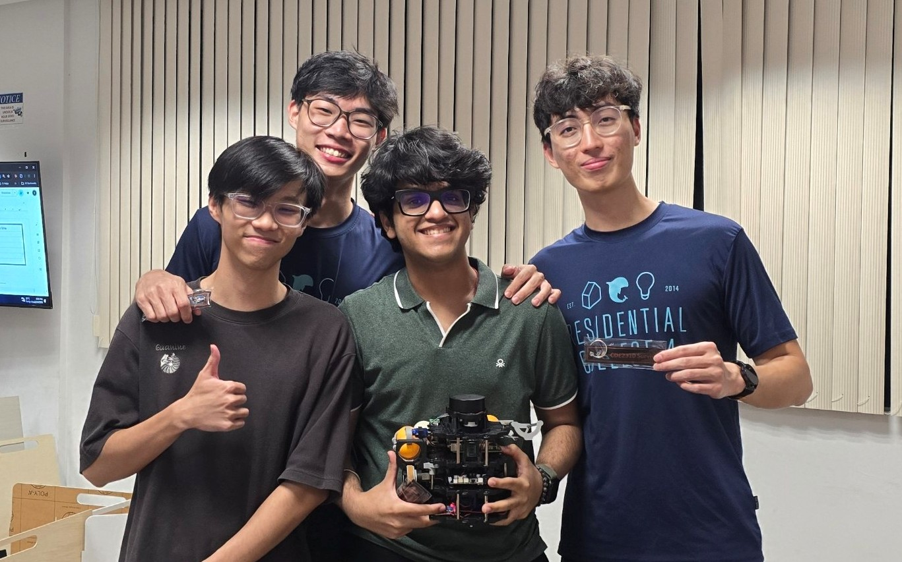
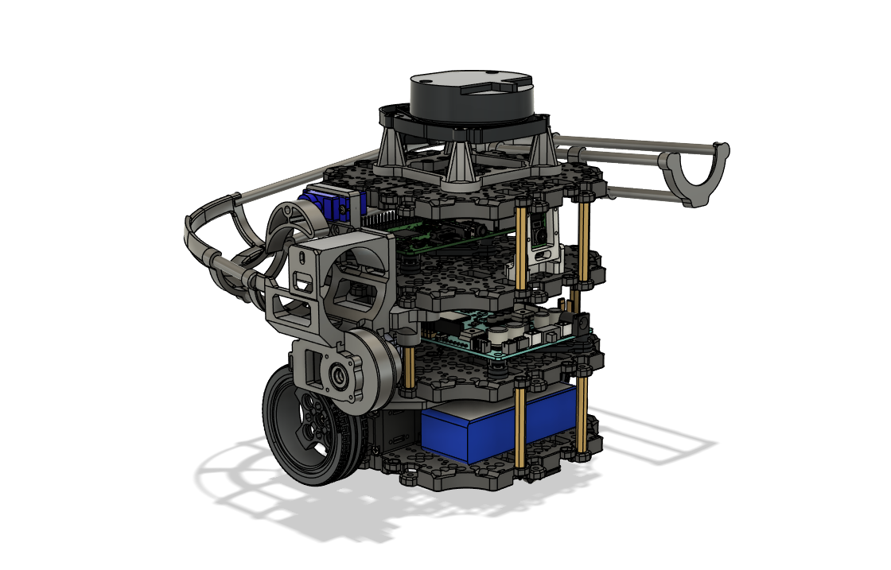
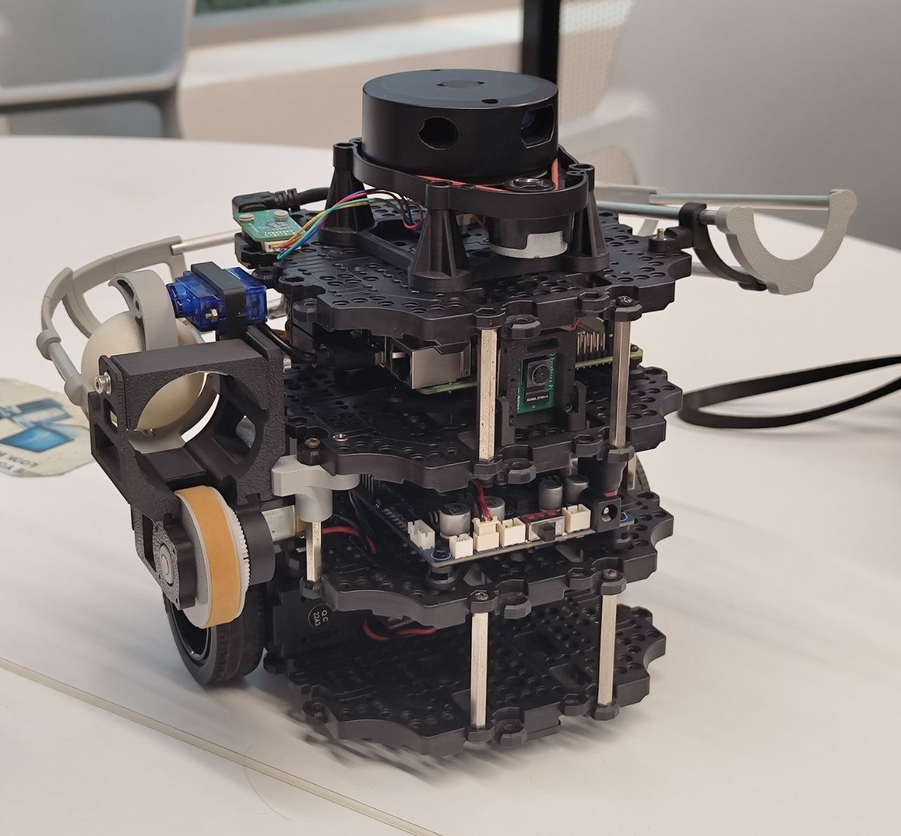
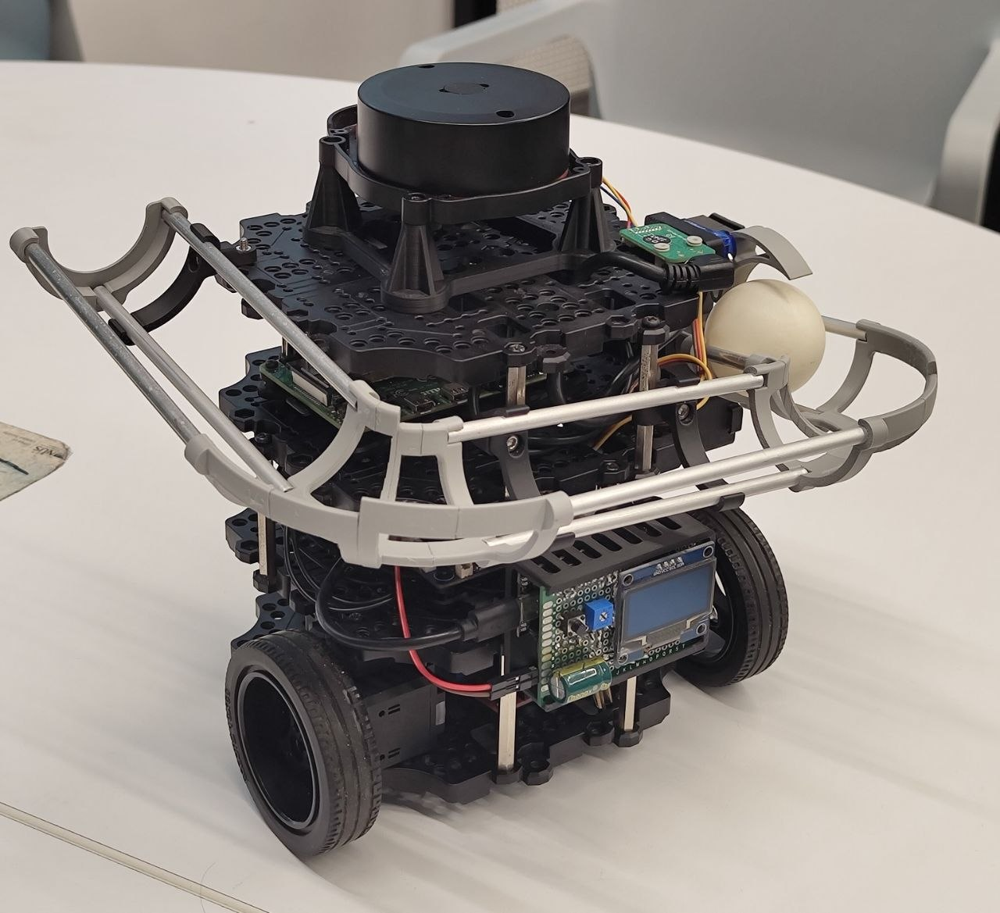

# CDE2310 AY2526 S2 Group 5 
[](https://docs.ros.org/en/humble/)
[](https://github.com/eggsacc/CDE2310-Docs/releases/tag/v1.0.0)
[]()



## Mission Overview
The main objective of this project is to design, create and validate an autonomous mobile robot (AMR system) based on the Turtlebot3 system to simulate intralogistics operations in a simulated smart warehouse environment. The AMR system must be capable of autonomously navigating an unknown maze-like environment while constructing a map of the environment, localizing itself and carrying out a series of tasks to deliver three ping pong balls into pre identified receptacles (static and dynamic) without human intervention or line-following methods.

---

## Mission Summary

| Station | Description | Status |
|---------|-------------|--------|
| **Station A** | Static delivery — detect QR/ArUco marker, align, and dispense 3 ping pong balls into a fixed receptacle in a timed sequence | 🟢 Completed |
| **Station B** | Dynamic delivery — track an oscillating motorised platform and dispense 3 ping pong balls onto the moving target | 🟢 Completed |
| **Station C/D** *(Bonus)* | Lift lobby → API call to summon lift → ascend to Level 2 → navigate to Station D and perform final delivery | 🚫 Aborted |

**Key constraints:**
- Full 25-minute window covers setup, mission execution, and arena cleanup
- No teleoperation once the mission clock starts
- Maximum 6 landmark markers (2 per delivery zone)
- Line-following navigation is **not permitted**; the robot must autonomously map and navigate
- RViz map screen recording is mandatory for all attempts

---

## Robot

Sexiest robot!




## Repository Structure

```
├── README.md ← you are here
├── CHANGELOG.md
├── .gitignore
├── docs/
│ ├── 01-requirements/
│ ├── 02-con-ops/
│ ├── 03-high-level-design/
│ ├── 04-subsystem-design/
│ │ ├── software.md
│ │ ├── hardware.md
│ │ └── electronics.md
│ ├── 05-icd/
│ ├── 06-testing/
│ ├── 07-user-manual/
│ └── 08-application-notes/
│
├── end-user-docs/
├── software/
│   ├── arduino/
│   │   └── launcher_firware.ino
│   ├── remote-pc/
│   │   └── auto_nav/
│   │       ├── auto_nav/
│   │       ├── resource/
│   │       ├── test/
│   │       ├── package.xml
│   │       ├── setup.cfg
│   │       └── setup.py
│   ├── rpi/
│   │   └── launcher_commander/
│   │       ├── launcher_commander/
│   │       ├── resource/
│   │       ├── test/
│   │       ├── package.xml
│   │       ├── setup.cfg
│   │       └── setup.py
│   └── README.md
│
├── hardware/
│ ├── BOM
│ ├── Main assembly (CAD)
│ ├── Assembly guide
│ └── manufacturing-guide.md
│
├── electronics/
│ ├── launcher-controller.md
│ └── power-budget
```

---

## Team

| Member | Role | GitHub |
|--------|------|--------|
| Gary chen | Software lead (ROS 2, SLAM, navigation) | @garychen177 |
| Wang yizhang | Hardware lead (payload mechanism) | @eggsacc |
| Gregorius Nicholas Sutedja | Electronics lead (wiring, power, sensors) | @Nikidudu |
| Garg Divyansh | Systems lead (SDD, ICD, testing, integration) | @garg-divyansh |

---

## Getting Started

### Prerequisites

- Ubuntu 22.04
- ROS 2 Humble ([installation guide](https://docs.ros.org/en/humble/Installation.html))
- TurtleBot3 packages

```bash
sudo apt install ros-humble-turtlebot3* ros-humble-navigation2 ros-humble-nav2-bringup
```
## Software Codebase setup
- [Remote PC Codebase](https://github.com/eggsacc/CDE2310-Docs/tree/main/remote_pc_codebase)

### Launch (full mission)

```bash
ros2 run auto_nav mainlaunch
```

> A single launch file is targeted for the full robot operation (bonus scoring criterion v).

---

## Software Architecture

> Detailed breakdown in [`docs/04-subsystem-design/software.md`](docs/04-subsystem-design/software.md)

Key ROS 2 nodes:

| Node | Description |
|------|-------------|
| `navigation_node` | Nav2-based autonomous navigation and SLAM |
| `marker_detection_node` | RPi Camera V2 — QR/ArUco marker detection and pose estimation |
| `payload_node` | Controls the ping pong ball dispensing mechanism |
| `mission_manager_node` | Top-level state machine coordinating the delivery sequence |
| `lift_api_node` *(bonus)* | Handles API calls to summon and command the lift at Station C |

---

## Hardware

> Full BOM and assembly guide in [`hardware/`](hardware/)

The TurtleBot3 Burger is modified with a custom payload mechanism and mount for the Raspberry Pi Camera V2 (8 MP). All custom components are documented in CAD files under [`hardware/cad/`](hardware/cad/).

---

## Contributing

### Branch Naming

Branches should follow the format `<type>/<short-description>` using lowercase and hyphens:

| Type | When to use | Example |
|------|-------------|---------|
| `feat/` | New feature or capability | `feat/aruco-docking` |
| `fix/` | Bug fix | `fix/lidar-wraparound` |
| `docs/` | Documentation only | `docs/update-icd` |
| `test/` | Tests or validation | `test/docking-alignment` |
| `hw/` | Hardware / CAD changes | `hw/payload-mount-v2` |
| `sw/` | Software changes not covered above | `sw/feat-docking-params` |

### Commit Messages

Commits follow the [Conventional Commits](https://www.conventionalcommits.org/) format:

```
<type>(<scope>): <short description>
```

| Type | When to use | Example |
|------|-------------|---------|
| `feat` | New feature added | `feat(docking): add three-phase ArUco docking` |
| `fix` | Bug fix | `fix(fsm): cancel nav goal on state change` |
| `docs` | Documentation update | `docs(sw): update FSM state diagram` |
| `test` | Tests or validation | `test(docking): add alignment tolerance test` |

- **Scope** is the subsystem or file affected (e.g. `docking`, `fsm`, `exploration`, `hardware`)
- Keep the description short and in the imperative mood ("add", "fix", "update" , not "added" or "fixes")

---

## Versioning

This project follows [Semantic Versioning 2.0.0](https://semver.org/).

```
MAJOR.MINOR.PATCH
  │      │     └─ backward-compatible bug fixes
  │      └─────── new functionality, backward compatible
  └────────────── breaking changes
```

### Changelog

All notable changes are recorded in [`CHANGELOG.md`](CHANGELOG.md), following the [Keep a Changelog](https://keepachangelog.com/en/1.1.0/) format. Changes are grouped under:

- **Added** — new features
- **Changed** — changes to existing functionality
- **Removed** — removed features
- **Fixed** — bug fixes

Unreleased changes are staged under `[Unreleased]` and moved to a versioned section upon release.

---

## Acknowledgements

Built on the [TurtleBot3](https://github.com/ROBOTIS-GIT/turtlebot3) platform by ROBOTIS.
Course module: CDE2310 Fundamentals of Systems Design, NUS College of Design and Engineering (EDIC).
Maze mission brief by Nicholas Chew, v1.0, Dec 2025.
