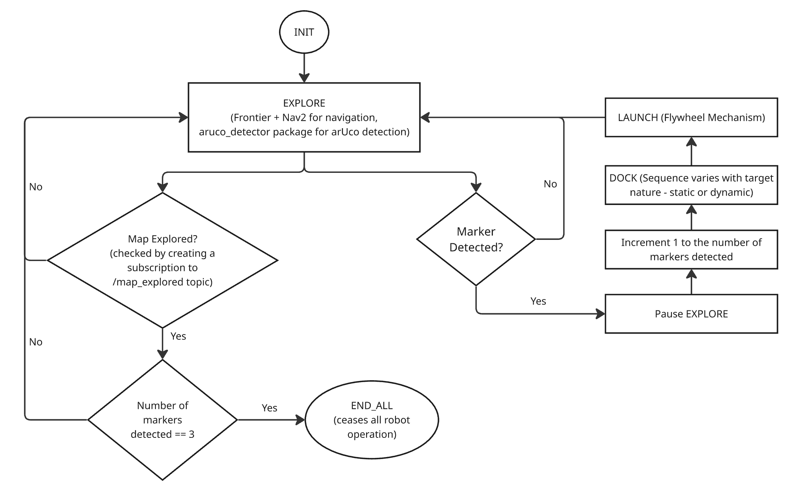

# Finite State Machine (FSM)

## Overview

The system is controlled using a Finite State Machine (FSM) implemented in the `mission_manager_node`.

The FSM coordinates navigation, vision, and payload subsystems to execute the mission autonomously.

---

## FSM Diagram

---

## State Definitions

### INIT
System startup and initialization of all nodes and packages.

### EXPLORE
Robot performs frontier-based exploration using Nav2 to map the environment.

### DOCK_A
Robot docks at Station A using the ArUco Marker.

### LAUNCH_A
Robot dispenses ping pong balls into receptacle A.

### DOCK_B
Robot docks at Station B using the ArUco Marker.

### LAUNCH_B
Robot dispenses ping pong balls into receptacle B.

### END
Mission complete.

---

## State Transitions

- INIT → EXPLORE (after initialization)
- EXPLORE → DOCK_A (marker detected)
- DOCK_A → LAUNCH_A (docking complete)
- LAUNCH_A → EXPLORE (delivery complete)
- EXPLORE → DOCK_B (marker detected)
- DOCK_B → LAUNCH_B (docking complete)
- LAUNCH_B → EXPLORE (delivery complete)
- EXPLORE → END (mission complete)
