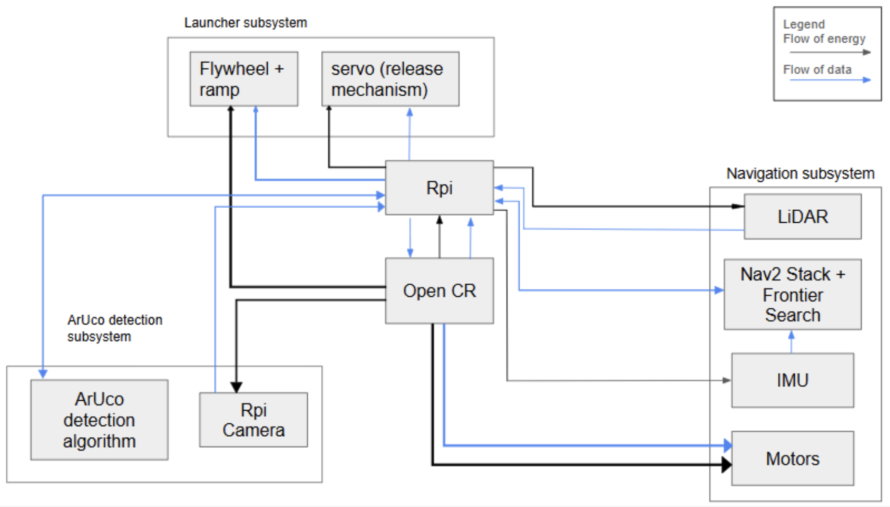

# System Architecture

## Overview

The Autonomous Mobile Robot (AMR) system is composed of four primary subsystems:

1. Navigation Subsystem  
2. Vision Subsystem  
3. Payload Subsystem  
4. Mission Manager (Finite State Machine)

These subsystems communicate through ROS 2 topics and TF transforms.

---

## System Architecture Diagram

---

## Subsystem Description

### Navigation Subsystem
Responsible for mapping and path planning using SLAM Toolbox and Nav2.

Inputs:
- 'EXPLORE' state from FSM
- /scan (LiDAR)
- /odom (odometry)

Outputs:
- Velocity commands to robot
- Completion status/error messages to FSM

---

### Vision Subsystem
Detects ArUco markers and estimates pose using OpenCV and PnP algorithm. Also controls docking of the robot in front of the receptacle via the ArUco Marker Detection.

Inputs:
- 'DOCK' status from FSM

Outputs:
- Marker pose (tvec, quaternion)
- TF transforms
- Docking completion status/error messages to FSM

---

### Payload Subsystem
Controls the flywheel launcher and ball feeding mechanism.

Inputs:
- 'LAUNCH' status from FSM

Outputs:
- Completion status/error messages to FSM

---

### Mission Manager (FSM)
Coordinates all subsystems based on mission state.

Inputs:
- Current Operation Status and Error Messages

Outputs:
- Current Bot State
- ArUco Marker ID for docking and launching
