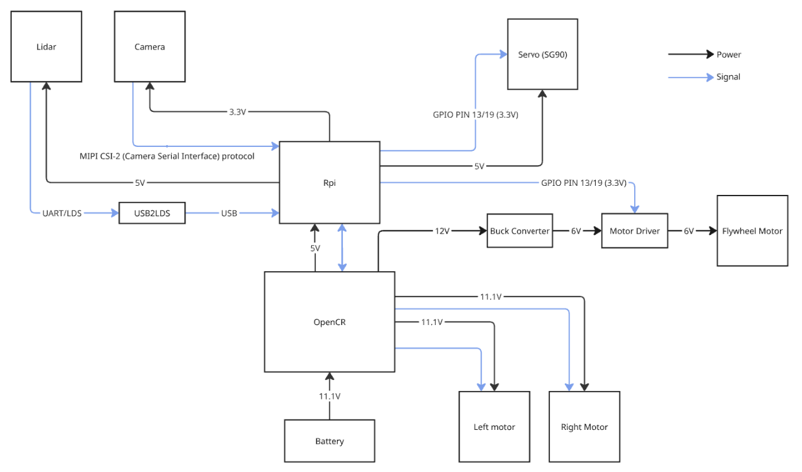
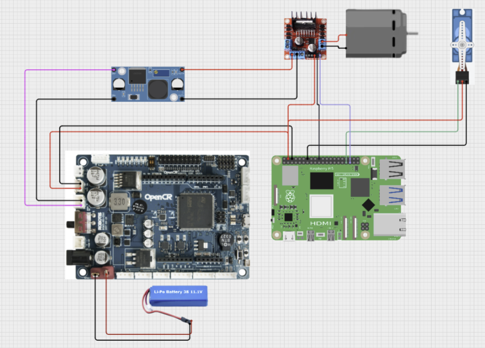

# Electronics Architecture

Below shows the breakdown of the electrical subcomponents:

Most of the electronics are already given via the turtlebot3 burger functioning model. The key components added to complete the mission is as follows:

- A SG90 servo motor for the feeding mechanism
- A buck converter converting the 12V from the OpenCR board into 6V for the DC motor
- A DC motor to spin the flywheel
- A motor driver to controll the speed of the flywheel

Below is the electronic launcher subsystem:

