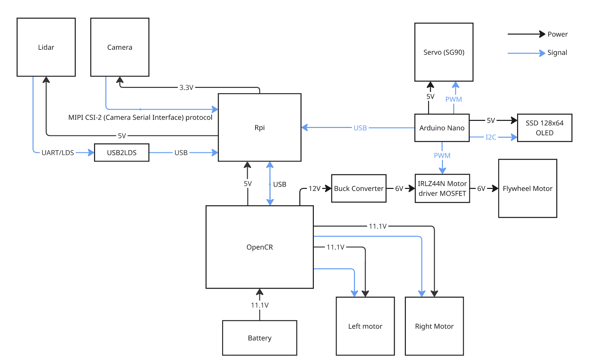
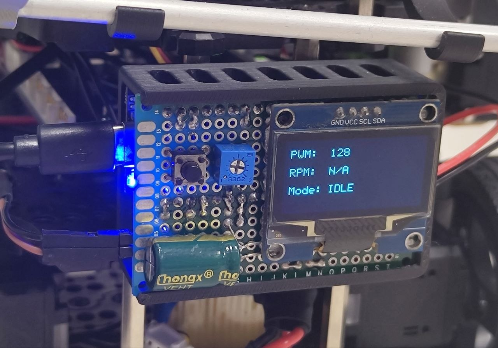
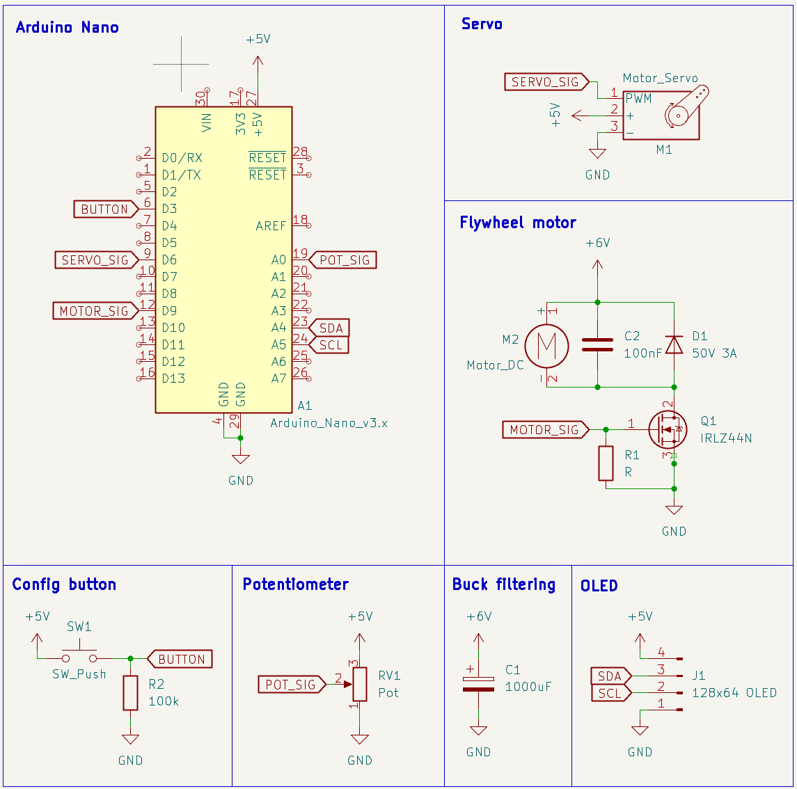

# Electronics Architecture

Below shows the breakdown of the electrical subcomponents:

The key components added to complete the mission is as follows:

- A SG90 servo motor for the feeding mechanism
- A buck converter converting the 12V from the OpenCR board into 6V for the DC motor
- A DC motor to spin the flywheel
- IRLZ44N MOSFET used to control motor speed
- Arduino Nano to offload launching sequence & launcher control
- SSD 128x64 OLED screen to look cool (and display real-time mission status)

## Launcher

Below is the electronics schematic for the launcher subsystem. To make the launcher truly a "subsystem", it features an integrated controller using the Arduino Nano. The launcher controller controls the servo and the flywheel motor. It also features a push-button and potentiometer input to allow the user to adjust the motor speed on-the-fly. A small OLED display is used to show real-timer operation status (and look cool).

### Features
- Press button to enter config mode.
- In config mode, turn potentiometer to adjust motor speed.
- Press button again to exit config mode and save motor PWM.

The controller is connected to the Raspberry Pi SBC via USB, and is supplied +6V power from a buck converter for the flywheel motor.

### Commands
- `"SLAUNCH"`: Execute static launch sequence
- `"DLAUNCH"`: Execute dynamic launch sequence
- `"SPIN"`: Starts flywheel
- `"FIRE"`: Feed a single ping pong ball
- `"PING"`: Serial connection check. Returns "PONG" if available.

