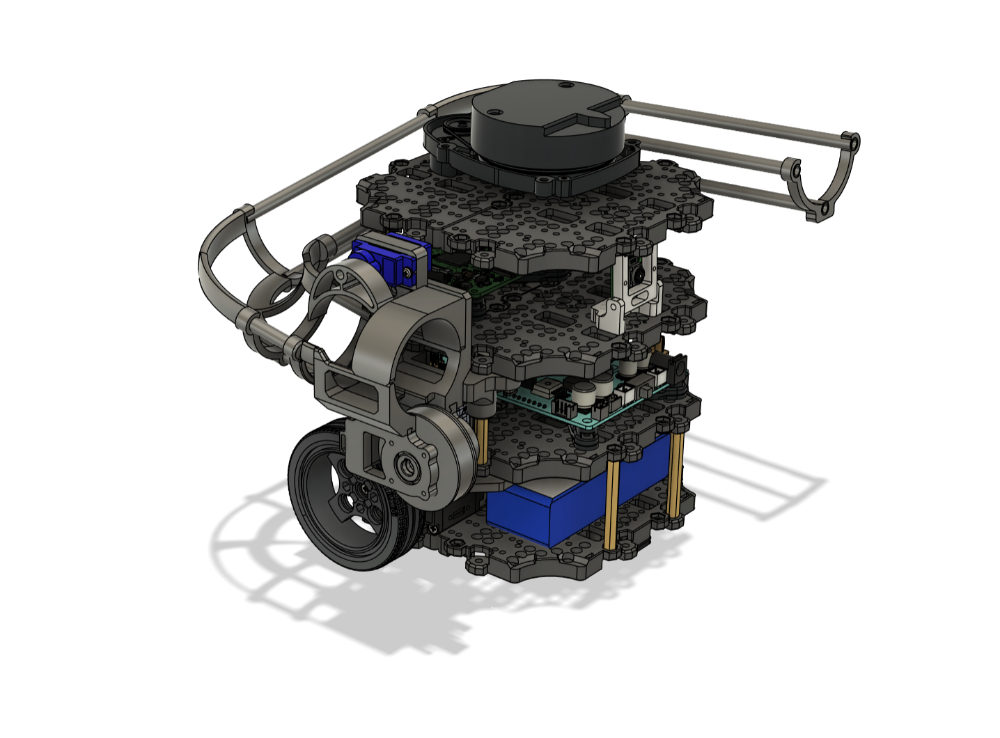
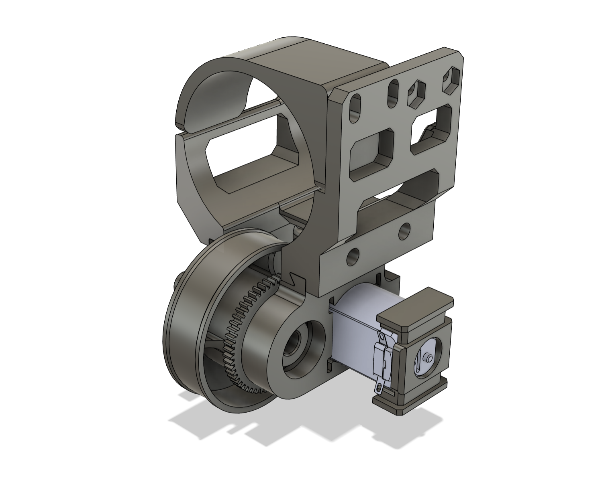
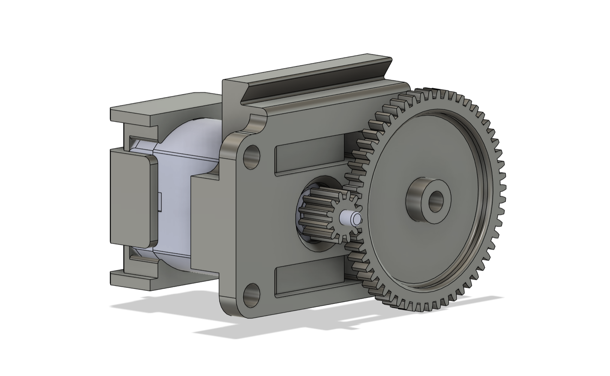
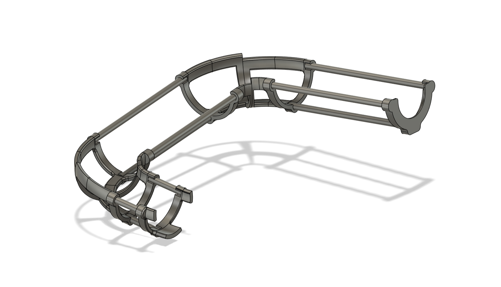
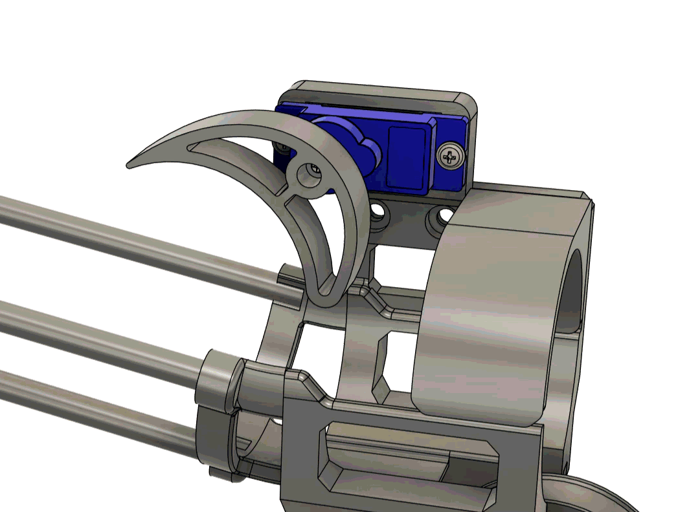
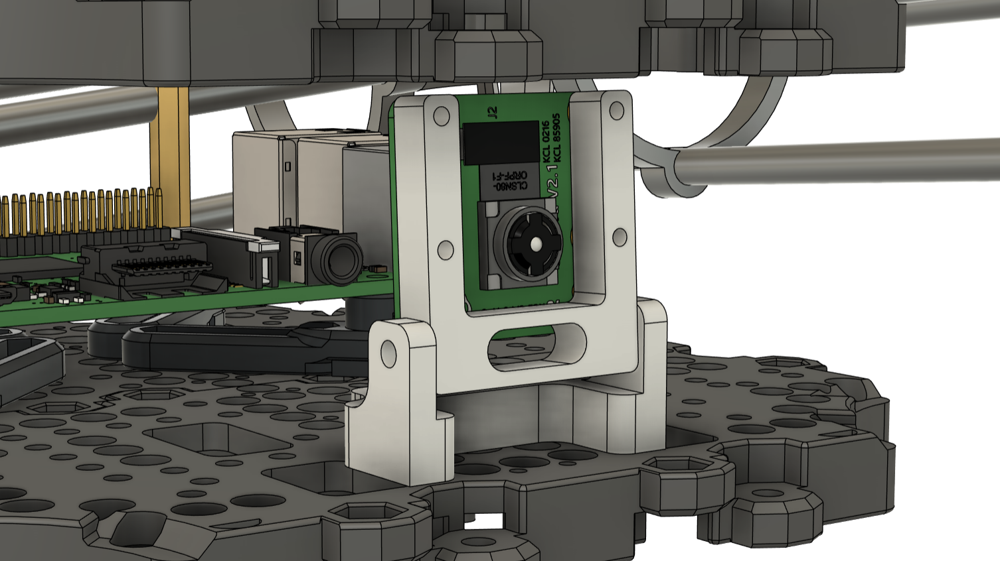
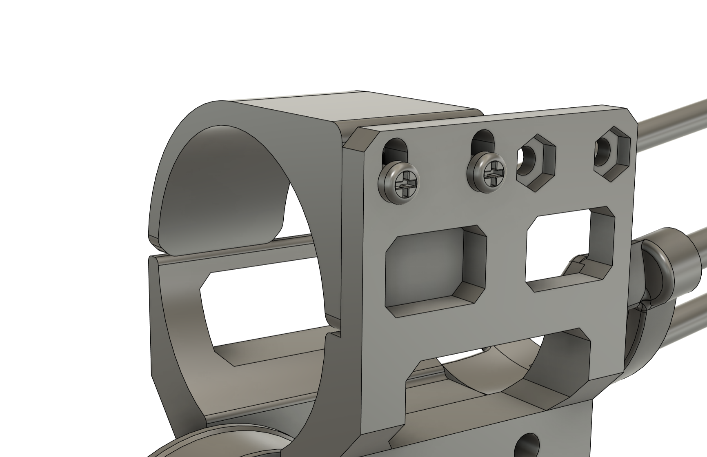
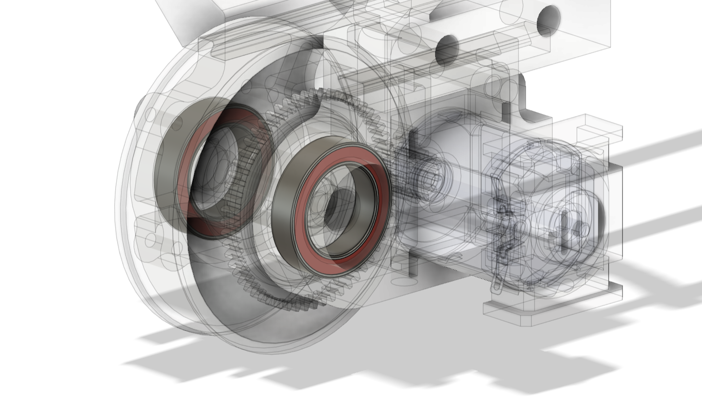

## 1) Hardware design overview
This document provides an overview of the hardware architecture for Turtlebot. The design focuses on modularity, compact integration and manufacutability, combining various 3D printed and off-the-shelf components to produce a clean, professional aesthetic.

## 2) Payload system architecture
- Launcher: single bottom flywheel
- Ball storage: skeletal ramp
- Ball feeder: servo driven indexer

## 3) Mechanical design
### 3.1) Flywheel launcher

Our robot uses a single, bottom-mount flywheel as the ping-pong ball launch mechanism. The design strikes a balance between manufacturability, modularity and aesthetics.

A single flywheel was chosen as the launch mechanism since:
- Launch distance is relatively short (~10cm based on chosen docking position)
- Driven by a single motor, decreasing power usage
- Simple to integrate into the space-constrained Turtlebot chasis without detrimental effects to overall CG
- Inherently introduces backspin on the ball, decreasing the chance of it bouncing out of recepticle

The flywheel uses the most common, off-the-shelf 130 Hobby DC motor (6V). This motor is optimized for low torque, high speed operations, with a rated no-load speed of up to 12,000 RPM. 

Hence, a 12:56 gear reduction is used to lower the flywheel speed and increase torque. This has the following benefits:

- Decrease motor acceleration load: motor draws less current to spin up the flywheel.
- Decrease recovery time between shots: motor experience less RPM drop per shot due to increased torque.
- Motor operates at high efficiency zone: the excess speed is traded for increased torque, allowing the motor to continue operating near the rated voltage instead of having to using a very low PWM duty cycle.

> 3D printed helical gears were used for the first few iterations, but quickly scraped due to manufacturing limitations. 3D printers are unable to produce the intricate gear tooth features accurately, resulting in grinding and noisy operations.
> 
> Common, off-the-shelf 0.5mm module plastic gears were used instead.

### 3.2) Storage ramp

The ping pong ball storage ramp is fabricated using 5mm aluminium rods and 3d printed connectors. Using aluminium rods as the ball guide eliminates the need to 3D print massive ramps that often require substential support materials while contributing to the clean, minimal aesthetic.

### 3.3) Ball indexer

A simple servo driven indexer is used to feed ping pong balls into the flywheel one at a time.

### 3.4) Camera

The RPI camera V2 is mounted on a simple, tilt-adjustable stand between the 3rd and 4th layer, facing the robot front.

## 4) Design features
### 4.1) Modularity
The whole hardware assembly consists of 20 different 3D printed components instead of being modelled as a single piece. This allows iterative design improvements on individual components instead of having to re-print the whole launcher.

The components are assembled together using 4 primary methods:
- Screws with heatset inserts
- Screws with inset nut
- Super glue
- Dovetail joint

Construction of the ramp using 5mm aluminium rods as ball guides also contributes to the modularity aspect. The length of the ramp could be easily modified by trimming down the rods, instead of re-printing the whole thing.

### 4.2) Adjustability
Building on the modular design aspect, the launcher assembly features some adjustable components. The ball exit hood, for example, can be adjusted vertically by loosening 2 screws to accomodate different rubber band thicknesses or the amount of flywheel contact.

The flywheel also allows lateral position adjustments since it is attached using a dovetail joint. These features allows us to adjust the launcher hardware on-the-fly, instead of redesigning in CAD and iterating multiple times.

### 4.3) 3D printing optimization
Most of the components in the assembly requires little to no support for 3D printing, drastically increasing the ease of production and decreasing print time (time = money). The components are designed with a ground-up approach: in the prelimary design stages of each component, a single plane is established as the "ground plane" where every other geometrical feature strictly builds up from. Such a design philosophy ensures that the components do not contain any overhangs/floating features when printed from the ground plane up, eliminating supports.

### 4.4) Bearings
Low-profile bearings are integrated into the design to constrain rotational motion and enhance flywheel smoothness.

### 4.5) Design aesthetics
The design uses appropriate cut-outs, fillets and chamfers where necessary for a consistant aesthetic across components. Each component integrated seamlessly into the final assembly, contributing to a coherent appearence.

