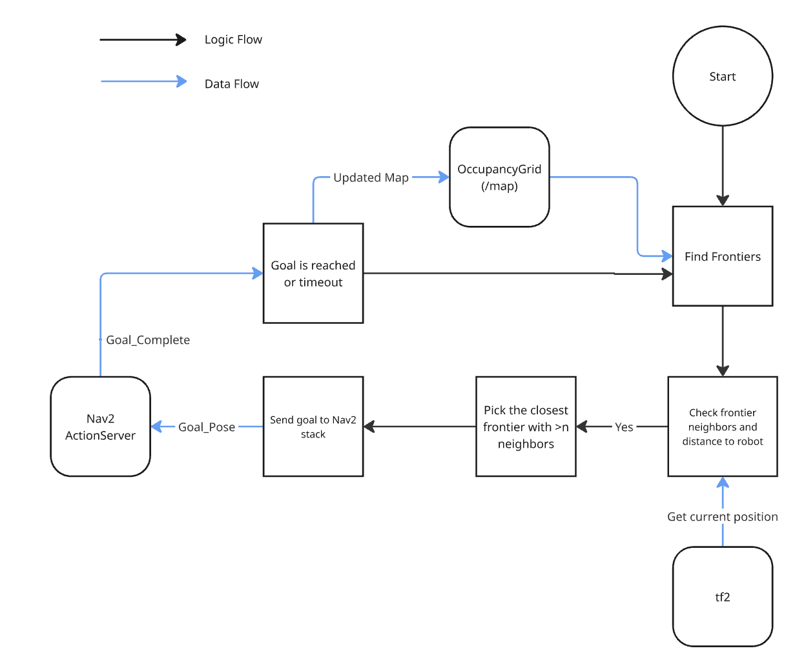
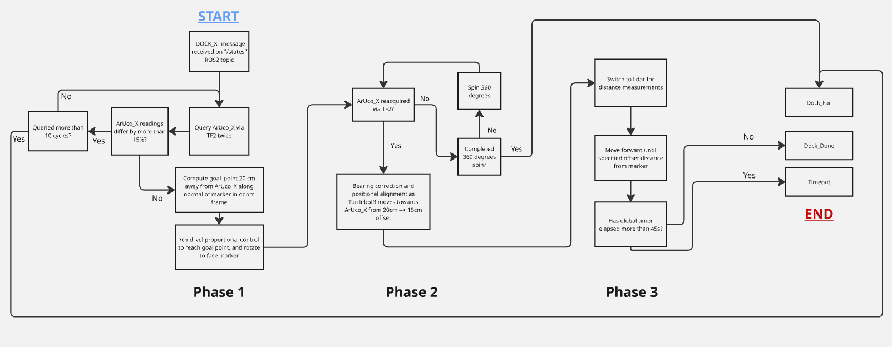

# Software Design Overview

This document provides an overview of the software architecture for Turtlebot. The design focuses on functionality over efficiency.

The software subsystem can be broken down into 2 parts:

**1. Autonomous Exploration**  
**2. Docking**

## 1) Autonomous Exploration

### 1.1 SLAM and Navigation2
In this project, SLAM is implemented using ROS 2 on the TurtleBot3 platform. The TurtleBot3 is equipped with a 2D LiDAR sensor, wheel encoders, and an onboard IMU (SLAM, 2023). These sensors provide laser scan data for obstacle detection and mapping (/scan), odometry data for motion estimation (/odom) and IMU data for orientation refinement.
The SLAM process is carried out using SLAM Toolbox, which performs graph-based SLAM. Robot poses are represented as nodes in a graph and sensor constraints are used to optimize the map. This approach improves accuracy by reducing accumulated drift over time. (from [slam_toolbox, n.d.](https://docs.ros.org/en/humble/p/slam_toolbox/))
After the map is generated, the navigation stack Navigation2 (Nav2) is used for path planning and obstacle avoidance. Nav2 utilises the static map from SLAM, real-time costmaps for obstacle updates, a global planner to compute optimal paths and a local planner to generate safe velocity commands

This enables the autonomous mobile robot (AMR) to autonomously navigate between **Station A**, **Station B**, and the optional **Station C** without prior knowledge of the maze layout.

### 1.2 Frontier-Based Exploration
Frontier exploration is a widely adopted strategy for autonomous mapping. A frontier is defined as the boundary between known free space and unknown space in an occupancy grid map. By continuously identifying and navigating toward these frontiers, the robot incrementally reveals unexplored regions until the environment is fully mapped.

The workflow is as follows: 
1. First there is Map Initialisation
2. SLAM begins generating an occupancy grid using LiDAR and odometry data. 
3. Unknown cells are gradually classified as free or occupied. 
4. A frontier search algorithm scans the occupancy grid to identify boundary cells between explored and unexplored areas.
5. Each frontier is then checked to count the number of neighboring frontiers, and distance to the robot's current position.
6. Potential frontiers are selected based on >n number of neighbors and closes distance to the robot's current position.
7. The selected frontier centroid is sent as a navigation goal to Nav2. 
8. The robot then navigates to the selected frontier. 
9. Upon reaching the frontier or after >m seconds (timeout), new areas become observable, and the cycle repeats until no significant frontiers remain.

## 2) Docking

### 2.1 Three-Phase Autonomous Docking

Docking is handled by `docking.py`, which navigates the TurtleBot3 to align precisely in front of an ArUco marker which will be pasted left of the target docking receptacle. The node is triggered via a `DOCK_<id>` message on `/states` and reports the outcome (`DOCK_DONE`, `DOCK_FAIL`, or `TIMEOUT`) on `/operation_status`. Docking proceeds through three sequential phases.

**Phase 1 — Odometry Navigation to Standoff (20 cm Default)**  
On receiving a dock command, the node queries the ArUco marker's pose via TF2 twice and rejects readings that differ by more than 15%, ensuring a stable initial estimate. It computes a goal point 20 cm in front of the marker along its normal vector, converts that point into the odometry frame, and drives there using proportional control. On arrival, it rotates to face the marker.

**Phase 2 — TF-Based Fine Approach (20 cm → 15 cm Default)**  
The node re-acquires the marker through TF2 with exponential moving average (EMA) smoothing applied to both position and orientation to reduce noise. It drives forward while blending two angular corrections: a bearing correction (to keep the marker centred at distance) and a heading alignment (to face the marker's normal up close). The phase completes once the robot holds lateral alignment within 0.5 cm for 0.5 s. If the marker is lost for more than 2 s, a 360° recovery spin is attempted; if the marker is not re-acquired by the end of the spin, docking is aborted.

**Phase 3 — LIDAR Final Approach (15 cm → 8 cm)**  
With heading already aligned from Phase 2, the node switches entirely to forward-facing LIDAR for distance measurement. Making use of the reading, the TurtleBot3 drives slowly to the 8 cm standoff distance and stops, then publishes `DOCK_DONE`.

A 45 s global safety timer aborts the sequence at any point if docking stalls and exceeds this 45s safety timer.

**Flowchart**

