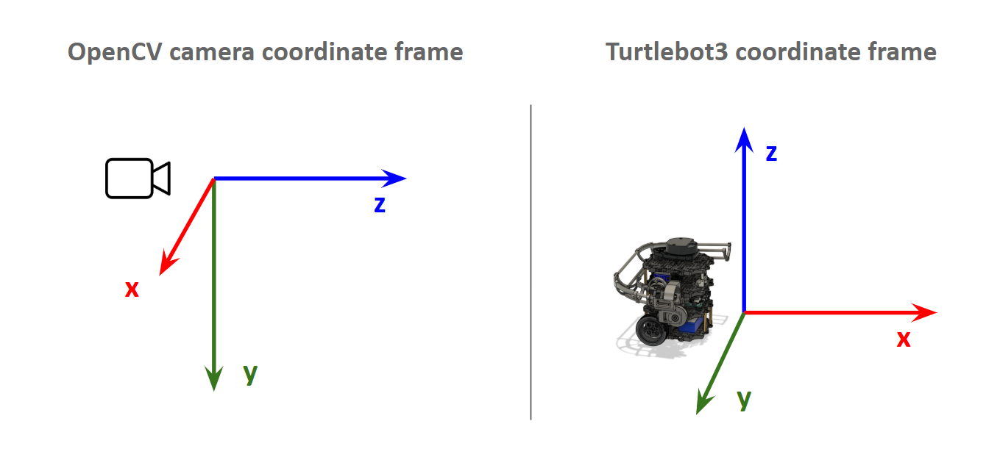

# Application Note — ArUco Marker Detection
AN-001 | v1.0 | 2026-04-05

## Purpose
Documents how ArUco marker detection is configured on the TurtleBot,
including camera calibration, detection parameters, and known limitations.

## Hardware
- Raspberry Pi Camera V2, 8MP
- Mounted 150mm from ground, 0° tilt, forward-facing

## How it works
ArUco markers are detected using the `aruco_detector` ROS2 package. The node
subscribes to `/camera/image_compressed`, runs detection on received frames at a fixed frequency, and publishes
the detected marker pose as a new link to the TF transform tree.

## Camera Calibration
The camera is calibrated to a resolution of 800x600p. The camera intrinisics matrix is defined as a numpy matrix in the source code:

```python
# REMOTE PC!
# ~/turtlebot3_ws/src/auto_nav/auto_nav/aruco_detector2.py

# ...
self.camera_matrix = np.array([
    [635.210233, 0.0, 396.543658],
    [0.0, 635.546243, 304.303293],
    [0.0, 0.0, 1.0]
], dtype=np.float64)
        
self.dist_coeffs = np.array(
    [0.166921, -0.270836, 0.001464, 0.000397, 0.0],
    dtype=np.float64)
```

## ROS2 Parameters
| Parameter | Default | Notes |
|-----------|-------|-------|
| `verbose` | `False` | Enable/disbale logger for debugging |
| `marker_size` | 0.08 | Physical marker size in metres |
| `frequency` | 10Hz | Throttled to reduce CPU usage |

## Camera startup parameters

The camera node is launched from the ROS bring-up script located at:

```bash
# RPI
~/turtlebot3_ws/src/turtlebot3/launch/bringup/turtlebot3.bringup.py
```
| Parameter | Value |
|-----------|-------|
| `format` | `YUV` | 
| `height` | 600  | 
| `width` | 800 | 

The 800x600 resolution is chosen since reducing it further results in the camera using "cropped mode", where it simply crops out a rectangle from the regular image instead of sub-sampling pixels. Cropped mode images are undesirable as it drastically decreases the FOV (from 60° to only about 20°), giving the output a very "zoomed in" effect.

## Output

When aruco markers are detected, the `aruco_detector` node publishes a new link in the TF tree with the name `aruco_marker_{id}`. The parent link is `camera_optical_frame`. 

## Intermediate link definition

The translation and rotation matrices caculated by OpenCV's `solvePnP()` is with respect to the image coordinate system, which is different from the coordinate system used by the turtlebot.



Hence, an intermediate link `camera_optical_link` is defined to transform the aruco pose to the turtlebot's coordinate system.

By observation, we can transform the OpenCV camera frame to the Turtlebot3 coordinate frame by:
1) Rotating 90° counter-clockwise about the y-axis,
2) Rotating 90° clockwise about the new x-axis,
3) And finally inverting the z-axis.

The `camera_optical_link` is defined by publishing a static transform to the TF tree with `base_link` as the parent and the above rotation matrix applied during ROS2 Bringup.


## Performance Envelope
Reliable detection: 0.3m – 1.2m, ±30° off-axis (camera FOV ~60°).

Degrades beyond 1.2m under arena fluorescent lighting.

## Caveats
- Marker pose estimation is quite accurate if calibration is done properly and aruco markers are dimensionally accurate. However, the estimated z-distance is the most unrealiable, hence LIDAR data is used in conjunction for accuracy.
- Glossy paper causes specular reflection — use matte print
- Unreliable detection if marker is more than 45° off-axis