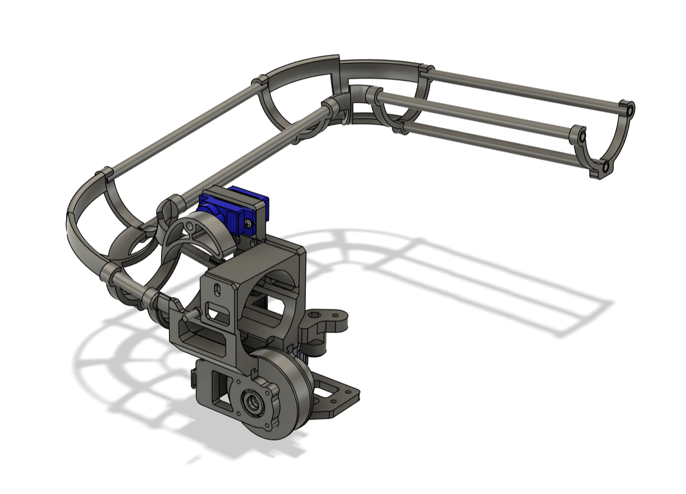
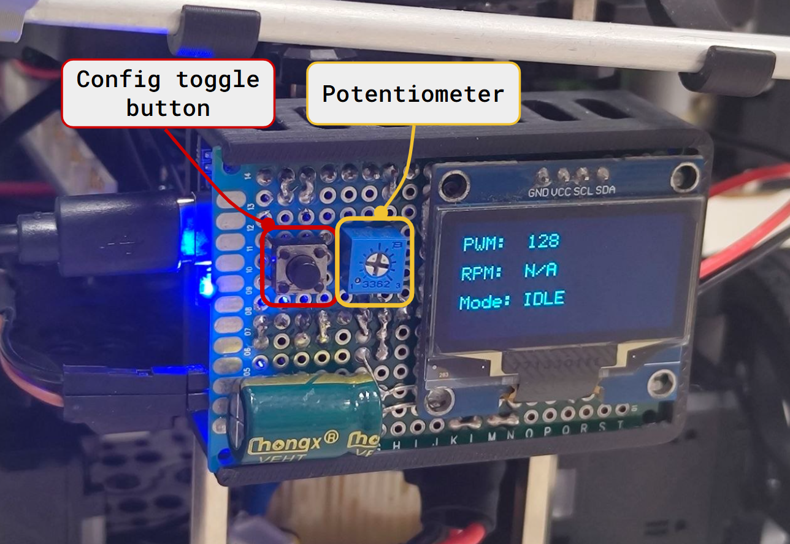
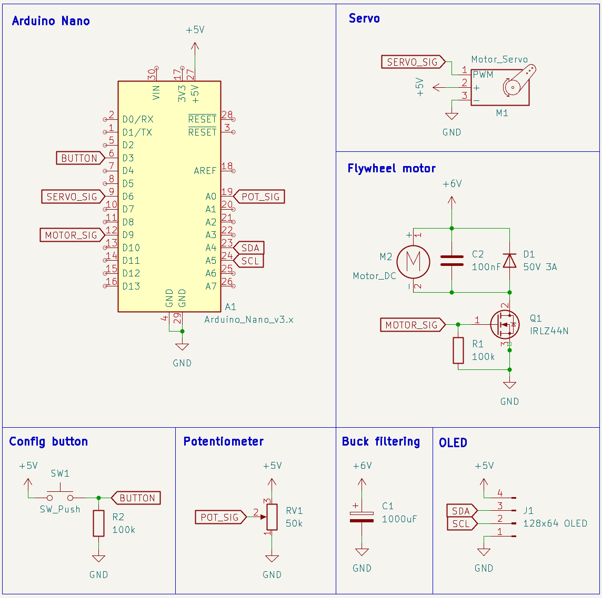

# Application Note - Payload Launch Mechanism
AN-002 | v1.0 | 2026-04-13

## Purpose

Documents the serial command interface, electrical connections, and operational
constraints for the G2 ping pong ball launcher, for integration with the RPi
ROS2 software stack.

---

## Overview



The launcher is a self-contained subsystem controlled by a dedicated Arduino Nano
launcher controller. The RPi issues high-level ASCII commands over USB serial -
the controller handles all timing, servo sequencing, and flywheel management
internally.


---

## Serial Command Interface

**Connection:** USB serial, `/dev/ttyUSB0` (see note below), 115200 baud

| Command | Description | Response |
|---------|-------------|----------|
| `PING` | Connection health check | `PONG` |
| `SPIN` | Start flywheel | none |
| `FIRE` | Feed one ball through the indexer | none |
| `STOP` | Stop flywheel | none|
| `SLAUNCH` | Full static delivery sequence (Station A) | none |
| `DLAUNCH` | Full dynamic delivery sequence (Station B) | none |

> **Port assignment:** Confirm the port with `ls /dev/ttyUSB*` before launch. To
> prevent the port changing between reboots, create a udev rule binding the
> Arduino's USB ID to a fixed symlink `/dev/arduino-launcher`.

### Example RPi Python usage

```python
import serial, time

ser = serial.Serial('/dev/ttyUSB0', 115200, timeout=1)
time.sleep(2)  # wait for Arduino reset on serial open

ser.write(b'PING\n')
assert ser.readline().decode().strip() == 'PONG', "Launcher not responding"

ser.write(b'SPIN\n')
time.sleep(2)
ser.write(b'FIRE\n')
time.sleep(2)
ser.write(b'STOP\n')
```

---

## Power Rails

| Rail | Source | Relevant to |
|------|--------|-------------|
| +6V | Buck converter (from OpenCR 12V) | Flywheel motor |
| +5V | Arduino Nano onboard regulator | Servo, OLED |

Do not command `SPIN` or `SLAUNCH` / `DLAUNCH` while the robot is actively
navigating - motor spin-up draws ~800mA peak on the +6V rail and may cause
voltage sag affecting the OpenCR board.

---

## Controller schematic



---

## Pin Assignment

| Arduino Pin | Signal | Connected to |
|-------------|--------|--------------|
| D3 | `BUTTON` | Config push button |
| D6 | `SERVO_SIG` | SG90 servo PWM |
| D9 | `MOTOR_SIG` | IRLZ44N gate (flywheel PWM) |
| A0 | `POT_SIG` | Speed potentiometer |
| A4 / A5 | `SDA` / `SCL` | OLED I2C |

---

## Timing Constraints

- The Arduino resets when the RPi opens the serial port - allow **2 seconds**
  before sending any command
- If using `SPIN` + `FIRE` manually, allow **~2 seconds** of spin-up before
  issuing `FIRE` - the feeder servo needs time to reset and load next ball.
- `SLAUNCH` and `DLAUNCH` handle spin-up internally; do not prepend a manual
  `SPIN` call when using these commands
- Optimal docking distance for consistent delivery is **100–150mm** from the
  receptacle.

---

## On-Robot Speed Tuning (Config Mode)

Motor speed can be adjusted without reflashing firmware:

1. Press the config button - OLED displays current PWM value
2. Turn the potentiometer to adjust speed
3. Press again to save PWM (temporary, resets to default of 128 on reboot)

---

## Known Limitations

| Issue | Impact | Mitigation |
|-------|--------|------------|
| Serial open resets Arduino | ~2s unavailable on startup | Always `PING` before first fire command |
| Motor spin-up current draw | Potential voltage sag on +6V rail | Do not launch during active navigation |
| Indexer gate misalignment | Ball jam | Physically check gate alignment before mission |
| Servo jitter due to EMI | Ball feeding sequence may fail if jitter is significant | Avoid running motor on full RPM to reduce EMI |

