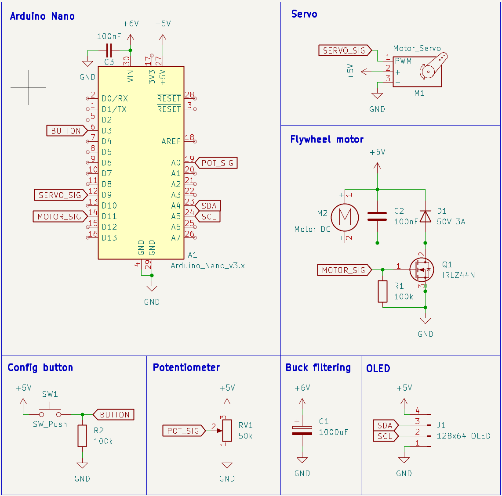
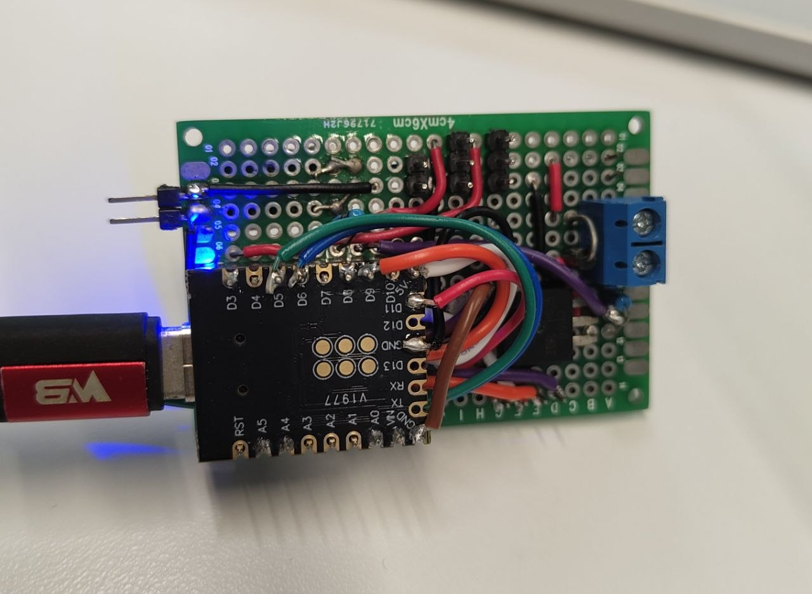
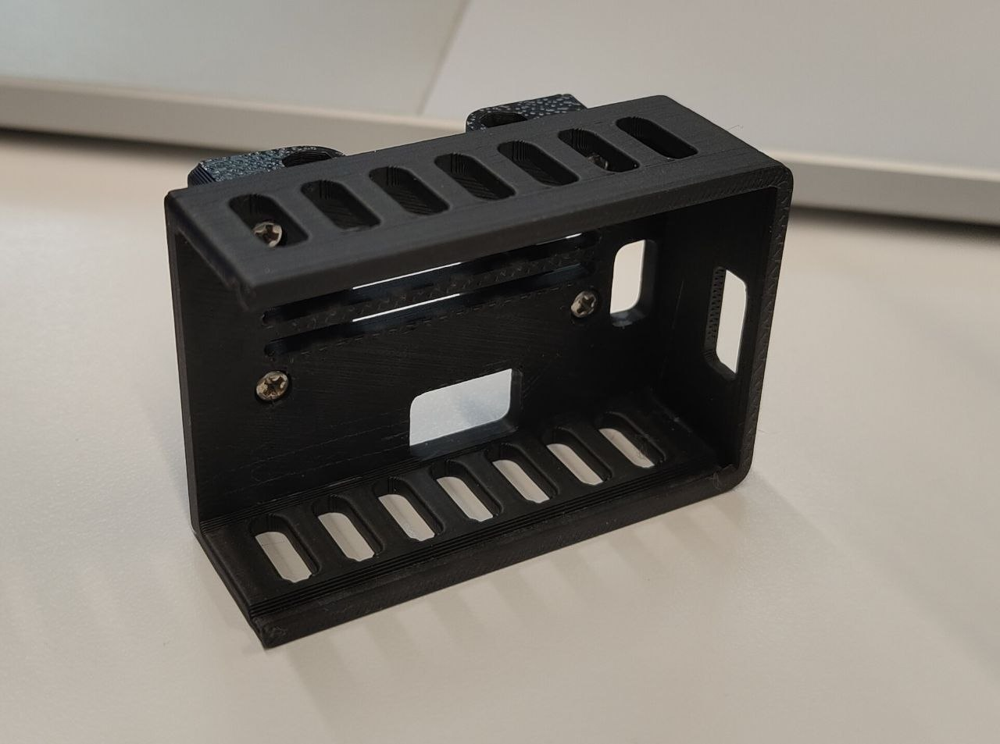
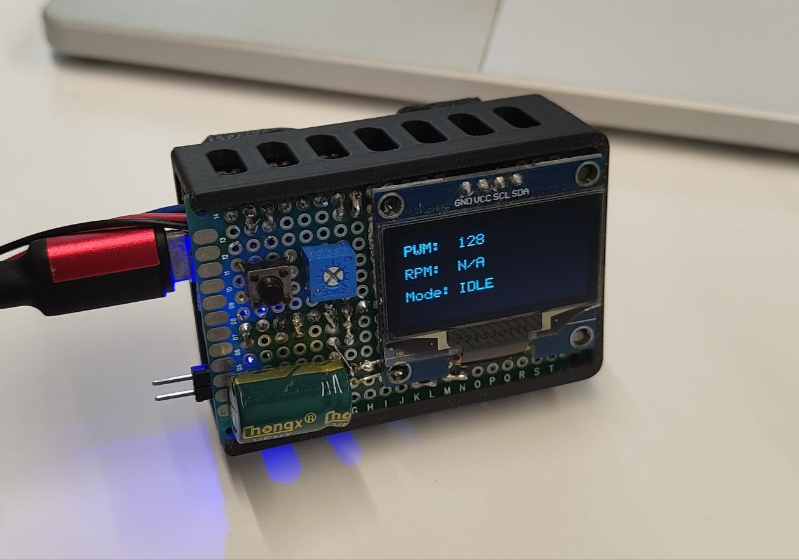

# Launcher controller

- 6V power rail stepped down from OpenCR 12V output using micror buck converter
- Power rail used mainly by flywheel motor, also to power Arduino Nano
- SG90 servo is powered from Arduino Nano 5V output due to noise (servo jitters if powered from same rail as flywheel)
- Arduino connected to Raspberry Pi via USB

## Schematic

## PCB

