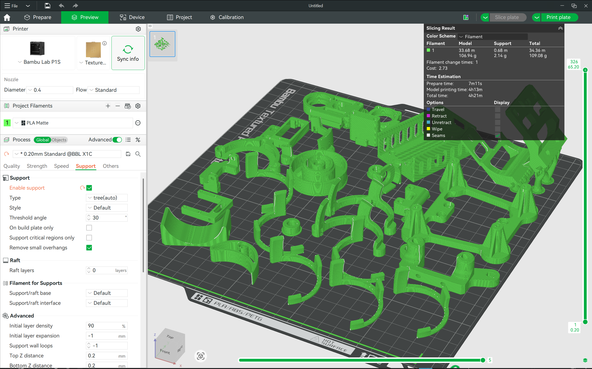
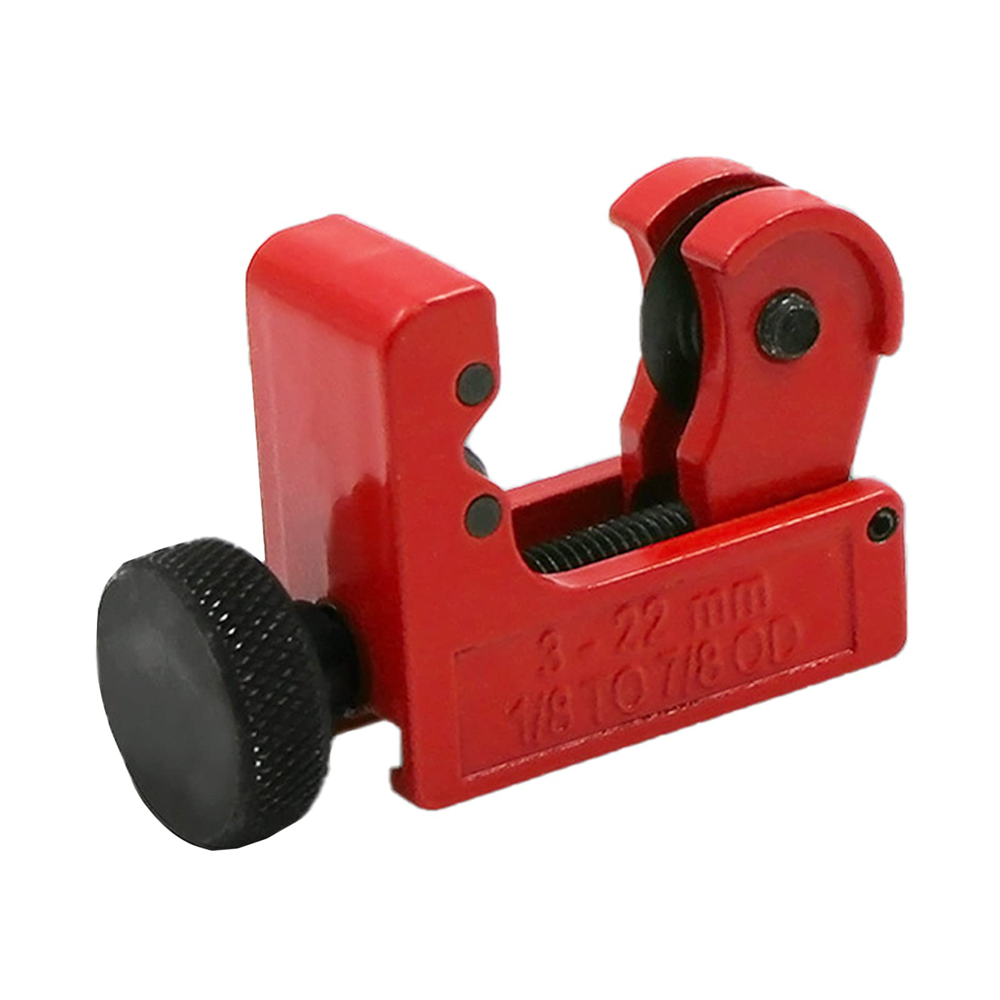
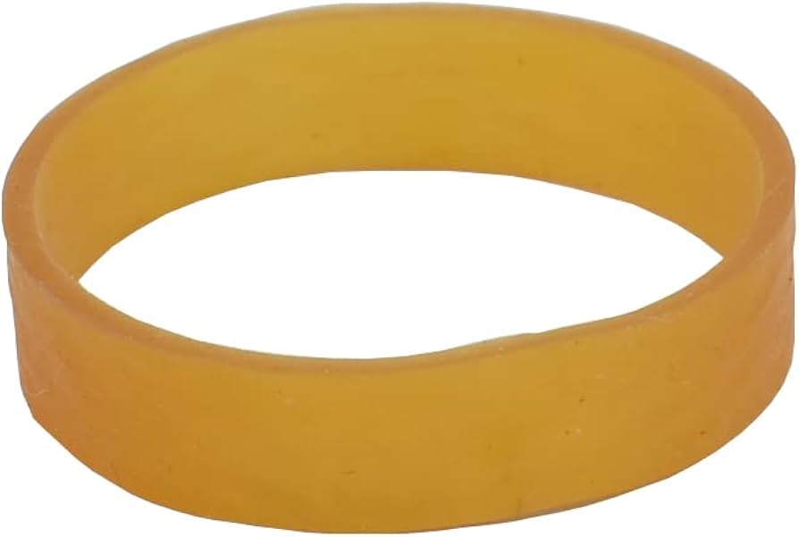
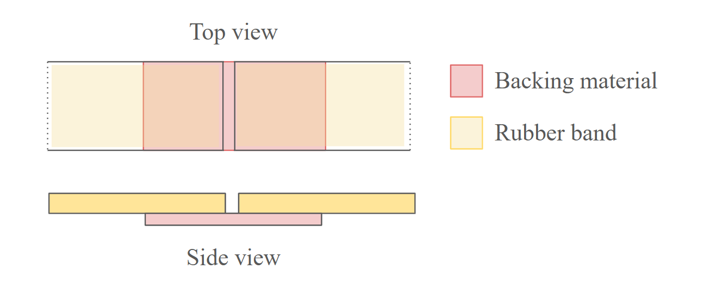

# 3D Printing

All the 3D printed components can be found in the folder `\3D print components`.

## Print settings
- If on Bambu/Orca slicer, select standard 0.2mm layer height profile
- Default infill 15%
- Import all components, and auto arrange
- Enable supports (tree), and set to auto
- Select "remove small overhangs" under support settings

The print takes just over 4 hours for all 26 components, and only uses 2.14g of support material (<2% of total material)!

---

# Off-the-shelf Components

- 6mm outer diameter, hollow aluminium rods can be purchased from Shopee or physically at ArtFriend (comes in pack of 3).
- Cut aluminium rods to length using a standard small tubing cutter

---

# Flywheel rim

The flywheel rim was fabricated from the common thick yellow rubber band.

If the rubber band is too loose, trim it to length and join it by gluing the 2 ends with a piece of backing material underneath. Simply gluing the 2 ends of the rubber band results in a very unreliable bond. Superglue is also known to cause the rubber band to become brittle over time, hence the backing material is required to allow more contact surface area and load distribution.

The backing material can simply be a piece of plastic cut out from heat shrink tubing.

# Post-processing

- Assuming parts are printed in PLA, heat-set inserts can be installed at a temperature of 250°
- Friction fit components such as the dovetail joint between flywheel assembly and launcher barrel may require light sanding for proper engagement.
