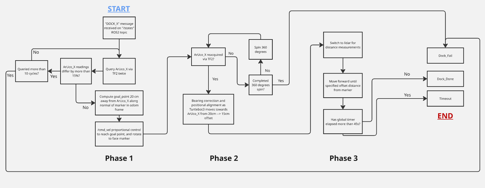

# Docking

## Three-Phase Autonomous Docking

Docking is handled by `docking.py`, which navigates the TurtleBot3 to align precisely in front of an ArUco marker which will be pasted left of the target docking receptacle. The node is triggered via a `DOCK_<id>` message on `/states` and reports the outcome (`DOCK_DONE`, `DOCK_FAIL`, or `TIMEOUT`) on `/operation_status`. Docking proceeds through three sequential phases.

**Phase 1 — Odometry Navigation to Standoff (20 cm Default)**  
On receiving a dock command, the node queries the ArUco marker's pose via TF2 twice and rejects readings that differ by more than 15%, ensuring a stable initial estimate. It computes a goal point 20 cm in front of the marker along its normal vector, converts that point into the odometry frame, and drives there using proportional control. On arrival, it rotates to face the marker.

**Phase 2 — TF-Based Fine Approach (20 cm → 15 cm Default)**  
The node re-acquires the marker through TF2 with exponential moving average (EMA) smoothing applied to both position and orientation to reduce noise. It drives forward while blending two angular corrections: a bearing correction (to keep the marker centred at distance) and a heading alignment (to face the marker's normal up close). The phase completes once the robot holds lateral alignment within 0.5 cm for 0.5 s. If the marker is lost for more than 2 s, a 360° recovery spin is attempted; if the marker is not re-acquired by the end of the spin, docking is aborted.

**Phase 3 — LIDAR Final Approach (15 cm → 8 cm)**  
With heading already aligned from Phase 2, the node switches entirely to forward-facing LIDAR for distance measurement. Making use of the reading, the TurtleBot3 drives slowly to the 8 cm standoff distance and stops, then publishes `DOCK_DONE`.

A 45 s global safety timer aborts the sequence at any point if docking stalls and exceeds this 45s safety timer.

**Flowchart**

